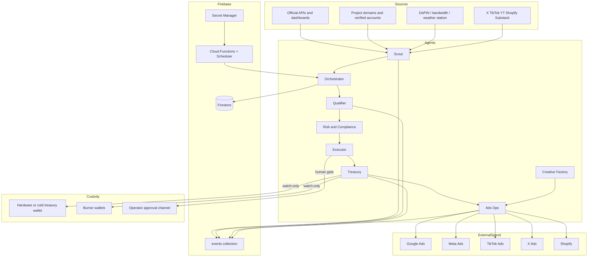

# Agent Griffty — Architecture

Runtime loop (default 15 minutes): snapshot world state → Orchestrator plan → dispatch → persist events → update dashboard.

Trust boundary: API tokens stay in Secret Manager / env. The browser dashboard is read-mostly. Wallet private keys never enter the store.

## Local vs Firebase

| Mode | Store | How |
|---|---|---|
| Default local | `.griffty/state.json` | `npm run dev:server` |
| Firebase emulator | Firestore | `firebase emulators:start --config infra/firebase.json` once CLI is installed |

Live connectors remain feature-flagged off until an official enrolled session exists.
